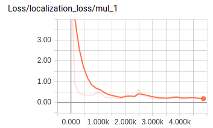
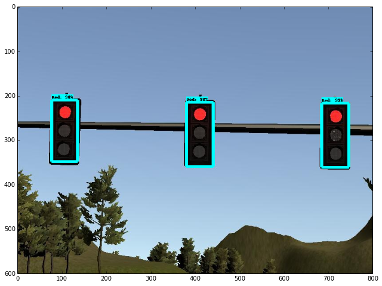

<h2>
This is our project submission for the code to run on Carla. The team breakdown and their tasks are given below
</h2>

* Salvatore Campagna	salvatorecampagna@gmail.com
* Yuan-Yao Huang	toby4548@hotmail.com
* Fabio Valerio Massoli	fabiovaleriomassoli@gmail.com
* Laszlo Keri	laszlo.keri@protonmail.com
* Pradeep Banavara pradeepbs@gmail.com (Team Lead)
<h3>
Our tasks and the accomplishments briefly
</h3>

Salvatore Campagna worked on the dbw module

The control module implements a **Drive-By-Wire (DBW)** system which is responsible
for generating electronics controls driving the car. The DBW node is implemented
as a ROS node in `dbw_node.py`.
It subscribes to the following topics:

* `/current_velocity`: topic reporting the current vehicle velocity
* `/twist_cmd`: topic reporting the target linear and angular velocities
* `/vehicle/dbw_enable`: topic reporting manual/autonomous mode

Given the inputs above the DBW node generates control commands on the following
topics:

* `/vehicle/throttle_cmd`: throttle command
* `/vehicle/brake_cmd`: calculated using the vehicle mass, acceleration and wheel radius
* `/vehicle/steering_cmd`: calculated using the yaw controller

When the DBW node object is instantiated in ROS, it subscribes to the topics above
registering callbacks for each. Each callback is responsible for storing the latest
values for the current velocity, twist command and if the DWB module is
enabled or not. Then it also creates publishers in order to be able to publish
control commands on the respective topics. Moreover, it also gets some parameters
from the ROS master node such as vehicle mass, fuel capacity, acceleration and deceleration
limits,... Those parameters are then used by the controller to compute the
control commands.

After the controller object is instantiated the DBW node enters a loop spinning
with a frequency of 50Hz. Every time the DBW node triggers, a new control
command is collected from the controller and written on the topics controlling
throttle, steer and brake.

The control logic generating steering, throttle and brake commands takes place
in the `control` function of the `Controller` object implemented in `twist_controller.py`.
There, the current velocity and the target velocity are collected and used for
the following computations.

First the steering command is generated using the yaw controller. Then, depending
on the values of the current and target velocity the controller determines if the
car is expected to accelerate or decelerate. If the car is expected to accelerate
a throttle command is calculated taking into account the car's acceleration limits.
If, instead, a deceleration is expected a brake command is calculated taking into
account vehicle mass, acceleration and wheel radius.

At this point the controller has computed the steering, throttle and brake commands
which are returned by the `control` to the DBW node in order for each to be
written on the specific topic by the respective publisher.

Laszlo Keri implemented the MPC Controller

We created an alterative MPC implementation to the PID based `twist_controller`. The MPC implementation uses a bit different architecture from the original project. In the original design the `waypoint_follower` component gets the `final_waypoints` and turns these into a `twist_cmd` that is exectued by the dbw node.

In the MPC implementation the `waypoint_follower` is not needed as the C++ `dbw_mpc` node directly subscribes to the `final_waypoints` coming from the `waypoint_updater` and uses these waypoints to fit a minimal cost control.

The core MPC controller is identical to the term 2 MPC implementation with costs tuned in the simulator. The C++ `dbw_mpc` node integrates this logic into the ROS framework:

* queries the ROS parameters
* subscribes to `dbw_enabled`, `final_waypoints`, `current_pose` and `current_velocity`
* the waypoints are converted to the cars coordinate system from `current_pose`, `psi` is converted from quaternion to euler
* the speed from the closest waypoint is passed to the MPC as target speed (instead of the original constant speed)
* calls the MPC that computes the optimal acceleration (with the ROS acceleration/deceleration constrains) and direction change
* sends out `steering`, `breaking` and `throttle` commands based on the MPC results

The cost optimization parameters are tuned so that the controller is stable up to 80 mph.

The code is on the seperate `mpc` branch as it has dependencies from the term 2 mpc project that need to be installed and that are probably not part of the Carla enviroment (ipopt, cppad). The submission contains the PID based implementation.

Tony worked on the tl_detector and the tl_classifier

### Traffic Light Detector

The tl_detector node consists of two part: tl_detector.py and tl_classifier.py.  

#### tl_detector.py

This node subscribes to the following topic:

* /base_waypoints: complete waypoint list of the track

* /current_pose: vehicle position at map coordinate.

* /image_color: images from the front facing camera on the car.

For testing, we also subscribes to:

* /vehicle/traffic_lights: provides traffic light position and state.

This node will publish the upcoming stop point if there is a red light ahead to:

* /traffic_waypoint

This node is finised with following step:

1. Get all the traffic light positions.

2. Get the closest waypoint to the car position from current pose.

3. Find the nearest traffic light

4. Check the state from /vehicle/traffic_lights topic.

5. Return the position waypoint if it is red or return -1 if it is at other state.

At this point, the /traffic_waypoint topic starts to publish meaningful values. The others can move on to finalize the waypoint_updater node. The traning image can also be obtained by checking the distance between car and traffic light. We saved the images when traffic light is less then 100m ahead the car.

Yuan-Yao Huang worked on the tl_detector and the tl_classifier modules

#### tl_classifier.py

The classifier was built with [tensorflow object detection api](https://github.com/tensorflow/models/tree/master/research/object_detection). We choose ssd_inception as our model because it not only performs good but is also small enough that we can put it in the github repo. 

To train the model, we took 200 images from the simulator and split into train and test dataset with the ratio 8:2. The train dataset is manually labeled with [Sloth](https://cvhci.anthropomatik.kit.edu/~baeuml/projects/a-universal-labeling-tool-for-computer-vision-sloth/) with 4 different classes(Green, Yellow, Red and UNKNOW) as a yaml file. For ssd_inception model, the weight pre-trained with COCO dataset is available. We did transfer learning with the last layer for 5000 step. The training curve and an example of prediction on the test dataset show in the following figures.

After the model is ready, we just do step 4. in tl_detector.py with the model prediction instead of getting it from the /vehicle/traffic_light topic. The model was trained with rgb8, so we also have to modify the color channel from bgr8 to rgb8 with openCV.

In conclusion, the ssd_inception model works pretty good on traffic light classification and is able to publish reasonable value to the /traffic_waypoint topic.

Fabio Valerio worked on the way point updater

The waypoint_updater node is in charge of:

defining a list of waypoints the car will follow
setting the proper velocity for them.
The node listens for the /base_waypoints, /current_pose and /traffic_waypoint topics and publishes the new car trajectory on the /final_waypoints topic.

The node publishes a new trajecotry containing 50 waypoints at a rate of 50 Hz and, at each iteration, it checks first if a new red light is ahead of the car. If it is actually the case then the waypoint_updater plans a slow down until a full stop before the red light.

The knowledge of the presence of the red light comes from the tl detector node that publishes on the /traffic_waypoint topic the id of the waypoint of the red light.

Whenever a message is received from the /traffic_waypoint, the traffic_cb callback gets called and the id of the waypoint of the red light is saved.

Pradeep Banavara worked on the traffic light classifier 

I built the object detection model using the Tensorflow object detection API and using the RESNET 101 as the base model. I followed the instructions on Tensorflow object detection to train the model.
I used the dataset from the rosbag dataset provided by Udacity. Used transfer learning to train the model on 10,000 iterations. Followed the steps as follows:

1. Download and extract the pre-trained model and weights from 
http://download.tensorflow.org/models/object_detection/faster_rcnn_resnet101_coco_11_06_2017.tar.gz
2. Create the dataset by extracting files and labels from RosBag
3. Train the model using the following command
python object_detection/train.py --logtostderr --pipeline_config=model/faster_rcnn_resnet101_tl.config --train_dir=../../data

Unfortunately the RESNET model didn't work for us and Tony's inception model seemed to be working fine. In the interest of time we are submitting with the working model. The RESNET model inference graph is located here https://s3.amazonaws.com/udacitycarndfinal/frozen_inference_graph.pb and the chunked files are also in the repository.

